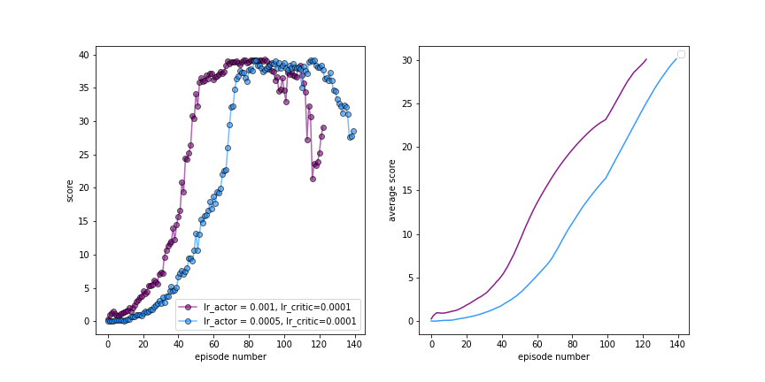

# Continuous Control Report
By: Stephen Hageman

## Intro
In this environment, a double-jointed arm can move to target locations. A reward of +0.1 is provided for each step that the agent's hand is in the goal location. Thus, the goal of your agent is to maintain its position at the target location for as many time steps as possible.

The observation space consists of 33 variables corresponding to position, rotation, velocity, and angular velocities of the arm. Each action is a vector with four numbers, corresponding to torque applicable to two joints. Every entry in the action vector should be a number between -1 and 1.

There were 2 options for this project based on the number of agents, either 1 agent or 20 agents.  The option selected for this project is the configuration with 20 simultaneous agents.  The problem is considered solved when the average score over all the agents is above 30, where the average is over all 20 agents and 100 consecutive episodes. 

## Implementation

### Learning Algorithm

NOTE: the agent and model code is based on the ddpg-pendulum example from this course, (see here)(https://github.com/udacity/deep-reinforcement-learning/tree/master/ddpg-pendulum).
The algorithm that was selected for this project is Deep Deterministic Policy Gradient (DDPG).  This is an off-policy algorithm which can concurrently learn a policy and Q function, and it is suitable for solving tasks in a contiuous action space.  This method uses two neural networks, the actor and the critic networks. The actor network is used to determine the optimal actions given the current state, and the critic network is used to estimate the Q function.  Furthermore, both networks have corresponding target networks that are used to stabilize the learning process by providing a fixed target.

Each training time step that occurs, the state, action, reward, and next state of all 20 agents are stored in a replay buffer.  Once the number of experiences is greater than the batch size of 256, the agent learns from a sample of the replay buffer at every time step. This consists of the actor estimating the optimal policy and the critic estimating the optimal Q function.  The corresponding rewards are returned for all 20 agents and they are averaged.

### Model and hyperparameters
The actor and the critic models have the following structure:

Actor:
* Batch normalization
* Linear linear layer with 33 features in, 256 features out
* Linear layer with 256 features in, 128 features out
* Linear layer with 128 features, 4 features out

Critic:
* Batch normalization
* Linear linear layer with 33 features in, 256 features out
* Linear layer with 260 features in, 128 features out
* Linear layer with 128 features, 1 feature out

The following hyperparameter were used:
* Batch size = 256
* Max number of episodes = 300
* Max number of time steps = 3000
* Max buffer size = 1e6
* Discount fatcor (gamma) = 0.99
* Soft update tau = 1e-3
* lr_critic = 1e-4
* lr_actor = 1e-3 and 5e-4
* weight_decay = 0
* Ornstein-Uhlenbeck mu = 0.0
* Ornstein-Uhlenbeck theta = 0.30 
* Ornstein-Uhlenbeck sigma = 0.2
                 
                
### Results: Plot of Rewards

Below are the results 

The plot on the left corresponds to the average score across all 20 agents, and the plot on the left is the average of those values over the past 100 episodes.  As you can see, two sets of hyperparameters were used (lr_actor = 1e-3 and 5e-4) and both were able to solve the scenario in 123 and 140 episodes, respectively.  One of the keys to solving this was adjusting the Ornstein-Uhlenbeck noise parameters. In particular, the parameter theta needed to be increased from 0.15 to 0.3, which has the effect of more quickly bringing the noise to the mean mu.

## Ideas for Future Work
This could be improved upon in many ways.  Firstly, hyperparaneter tuning could be further performed to enhance the performance of the current algorithm.  Secondly, different algorithms could be used instead.  For example, PPO could potentially perform better than DDPG for this task since it is generally less sensitive to hyperparameters and noise and therefore more stable.
